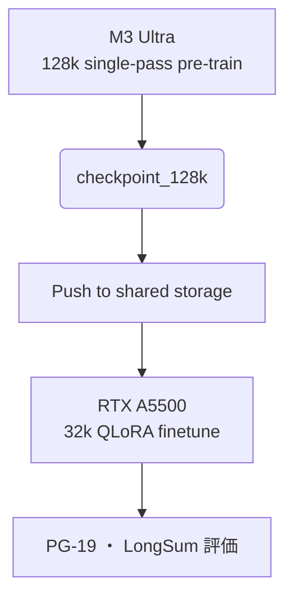

# Dendrite‑Transformer — **Single‑Node Edition**  
*Target machines: **Apple M3 Ultra (UMA 512 GB)** or **NVIDIA RTX A5500 (24 GB VRAM)***

---

## 0. 前提・開発フロー

| 項目 | M3 Ultra (Apple Silicon) | RTX A5500 (24 GB CUDA) |
|------|--------------------------|-------------------------|
| OS / Driver | macOS 15.* + MLX 0.8 | Ubuntu 24.04 + CUDA 12.5 |
| 最大メモリ | **UMA 512 GB** (shared) | **VRAM 24 GB** + 256 GB system |
| 並列性 | 38‑core GPU, **MPS** backend | CUDA cores ×1 GPU |
| 長文適性 | 128 k token *single pass* | 32 k token (Flash‑Attn) |
| 役割 | **長コンテキスト実験／推論** | **高速学習／デバッグ** |

**開発スタイル**  
* M3 Ultra → ロングコンテキスト & 推論ベンチ  
* RTX A5500 → 8‑bit / QLoRA 学習ループ + Flash‑Attention 2

---

## 1. ディレクトリ構成

```
dendrite-transformer/
├─ model/           # 共通 (PyTorch + optional MLX)
├─ runner/
│   ├─ train_mlx.py     # M3 Ultra 専用
│   ├─ train_cuda.py    # RTX 専用
│   └─ evaluate.py
├─ yaml/
│   ├─ 128k_m3ultra.yaml
│   ├─ 32k_rtx_debug.yaml
│   └─ finetune_pg19.yaml
└─ ...
```

---

## 2. コンフィグ例

### 2.1 `128k_m3ultra.yaml`
```yaml
model_name: dendrite-13b
seq_len: 131072
batch_size: 1            # UMA512GB で single‑example
precision: bfloat16
optimizer: lion
device: mps              # MLX backend 自動切替
gradient_checkpointing: false
```

### 2.2 `32k_rtx_debug.yaml`
```yaml
model_name: dendrite-7b
seq_len: 32768
batch_size: 4
precision: fp16
optimizer: adamw_8bit    # bitsandbytes
flash_attention: true
gradient_checkpointing: true
lora:
  r: 16
  alpha: 32
  dropout: 0.05
```

---

## 3. トレーニングパイプライン



| ステージ | 目標 | 所要 |
|----------|------|------|
| 128 k Pre‑train (M3) | ロングレンジ表現獲得 | 4 – 5 days |
| 32 k QLoRA Finetune (RTX) | +3 pp ROUGE‑L | 1 day |
| 推論ベンチ (M3) | メモリプロファイル | <1 h |

---

## 4. 実装メモ

* **共通コード**で `torch.backends.mps.is_available()` を検出し MLX にフォールバック。  
* Flash‑Attention 2 は `train_cuda.py` 内で `auto_install()` 呼び出し。  
* 8‑bit Optimizer: bitsandbytes は CUDA のみ — Apple Silicon では無効化。  
* 長文テストは `evaluate.py --scenario 128k` で自動スキップ判定。

---

## 5. リスク & 対策

| リスク | 兆候 | 対策 |
|--------|------|------|
| M3 発熱→クロック低下 | tokens/s が落ちる | `torch.set_num_threads(12)` で温度抑制 |
| RTX VRAM OOM | step 中に CUDA OOM | gradient_checkpointing + `flash_attn_chunk=512` |
| MLX バグ | NaN, segfault | `pip install mlx-nightly` ＋ issue 報告 |

---

## 6. ロードマップ (修正版)

| 版 | 機能 | 期日 |
|----|------|------|
| v0.1 | Core Block + unit test (両環境) | 2025‑08 |
| v0.2 | 128k pre‑train (M3 Ultra) | 2025‑09 |
| v0.3 | 32k QLoRA finetune (RTX) | 2025‑10 |
| v0.9 | Docs 完備 | 2025‑10 |
| v1.0 | 論文公開 | 2025‑11 |

---

## 7. 次のステップ

1. `train_mlx.py --config yaml/128k_m3ultra.yaml` で **1000 step smoke test**  
2. `train_cuda.py --config yaml/32k_rtx_debug.yaml` で **LoRA 勾配確認**  
3. GitHub Actions で macOS & Linux の **matrix CI** を追加

---

> 本ドキュメントは <dendrite_transformer_design_machines.md> として保存されます。
